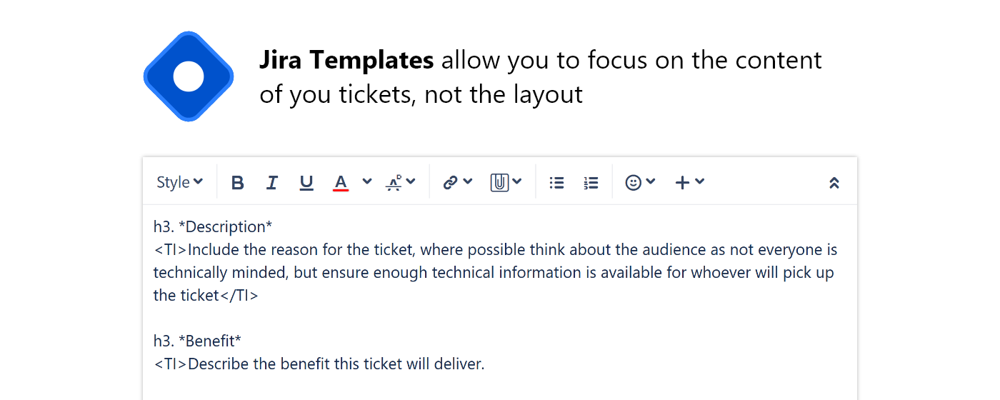

# Jira Templates

Jira Templates supercharges your Jira workflow. It allows you to define templates for different Jira ticket types which are automatically applied. If the templates have placeholders, you will then be able to replace them as you go.

## Features

- Per project and per issue type templates
- Navigable placeholders within templates
- Automatically apply templates when changing issue type
- Shareable configuration

## Downloads

- [Chrome](https://chrome.google.com/webstore/detail/hcmiibnefoddlhmdgjkkdkdcfenncfmh)
- [Edge](https://microsoftedge.microsoft.com/addons/detail/jldfcajijmnoomfkhiefappjmljjmack)
- [Firefox](https://addons.mozilla.org/en-GB/firefox/addon/jira-templates/)

---

## Requirements

- Nodejs v12+
- yarn v1.22+

## How to Build

1. Restore the project dependencies by running `yarn`/`npm install`.
2. Run `yarn dev`/`npm run dev` to build the project is development mode.

## Extension Debugging

Load the extension by pointing Firefox to the `dist/manifest.json`. Be sure to provide a domain in the extension's Options tab.
